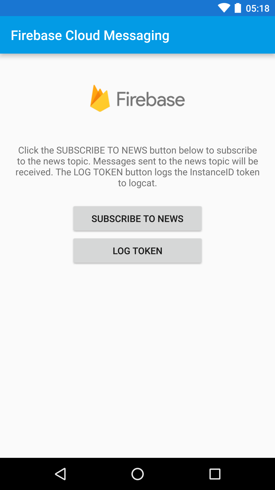

= Push Notifications addon

This addon adds Push Notifications capabilities to eXo mobile applications.

== Installation

At the root of your eXo Platform distribution, execute:

`./addon install exo-push-notifications`

== Configuration

=== Firebase

This addon relies on Firebase to manage Push Notifications, so you must first create the Firebase project:

* go to the https://console.firebase.google.com/[Firebase console]
* login with your Google account
* click on *Add Project*
* give a name to your project and click on *Create Project*

You should now be redirected to the Firebase console, where you can create Android and iOS apps.

==== Android

In order to push mobile notifications to the eXo Android app, follow these steps:

* click on *Add Firebase to your Android app*
* set the `Android package name` to `org.exoplatform`, and optionally set an app nickname
* click on *Register App*
* click on *Continue*, then *Finish*

==== iOS

TODO

=== API enabling

The Firebase Cloud Messaging API must be enabled in order to be able to use it:

* go to the https://console.developers.google.com[Google Developer console]
* select your Firebase project
* click on *Firebase Cloud Messaging API*
* click on *Enable*

==== eXo Platform

eXo Platform needs to know which Firebase project to send notifications to and with which credentials:

* in the https://console.firebase.google.com/[Firebase console], go to the Settings of your Android app
* go to *Service Accounts*
* click on *Generate New Private Key*
* save the JSON file in the file gatein/conf/fcm.json of your eXo Platform instance (this is the default
location for this file, but it can be changed via the parameter `exo.push.fcm.serviceAccountFilePath` in exo.properties)

The following options can also be configured in exo.properties:

* *exo.push.fcm.message.expirationTime* : how long (in seconds) the message should be kept in FCM storage
if the device is offline - defaults to the default value of FCM
* *exo.messaging.token.expirationTime* : how long (in seconds) an inactive token is kept in the database before
being deleted

== Usage

You can now start your eXo Platform instance. Once started:

* login with any user
* go to your Notifications settings page (User Menu > My Notifications).
* enable any type of notification you want to receive on your mobile

Once done, login with the eXo mobile application and start using it.
You should now receive push notifications.

== eXo Platform Compatibility

[caption=""]
|===
|Addon Version |eXo Platform Version

|1.0.x
|4.4.0+

|===

== How to test without the eXo mobile app ?

In order to test push notifications without the eXo mobile app, Firebase provides
https://github.com/firebase/quickstart-android/tree/master/messaging[a sample mobile application] which allows to
display them.
You can run it with Android Studio.

Once launched:

* the sample application should open:

* click on the button *Log Token*. It will display a token on the screen and in the logs in Android Studio.
* copy this token
* call the REST service to register the device in eXo:

[source,shell]
----
curl \
    -H "Content-Type: application/json" \
    --user root:gtn \
    -X POST -d '{"token": "<my-token>", "username": "<my-username>", "device": "android"}' \
    http://localhost:8080/rest/private/v1/messaging/device
----

The token is now registered in the database.
You can start receiving push notifications on the sample Firebase mobile app:

You can use the https://console.developers.google.com[Google Developer console] to monitor the notifications sent.